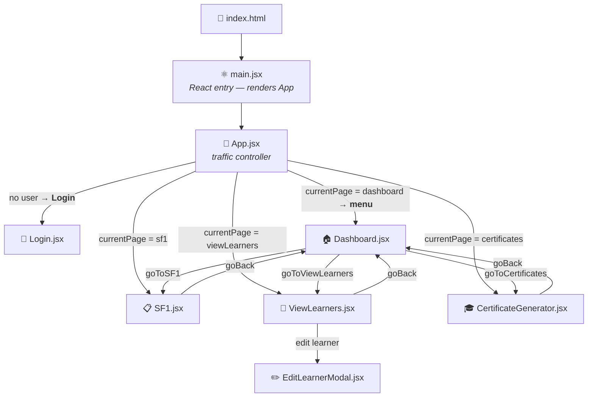
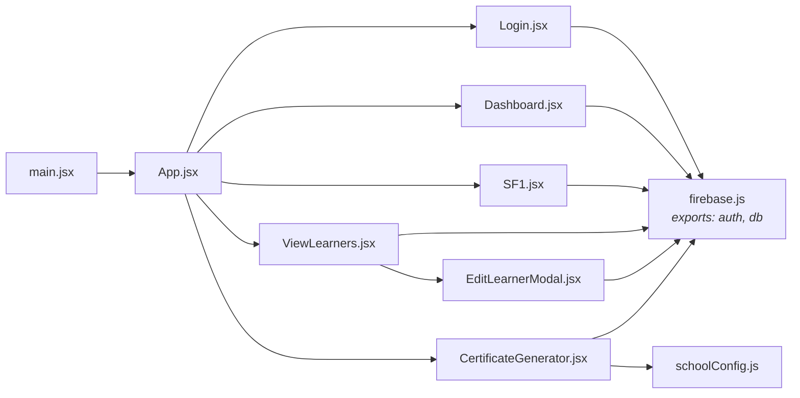
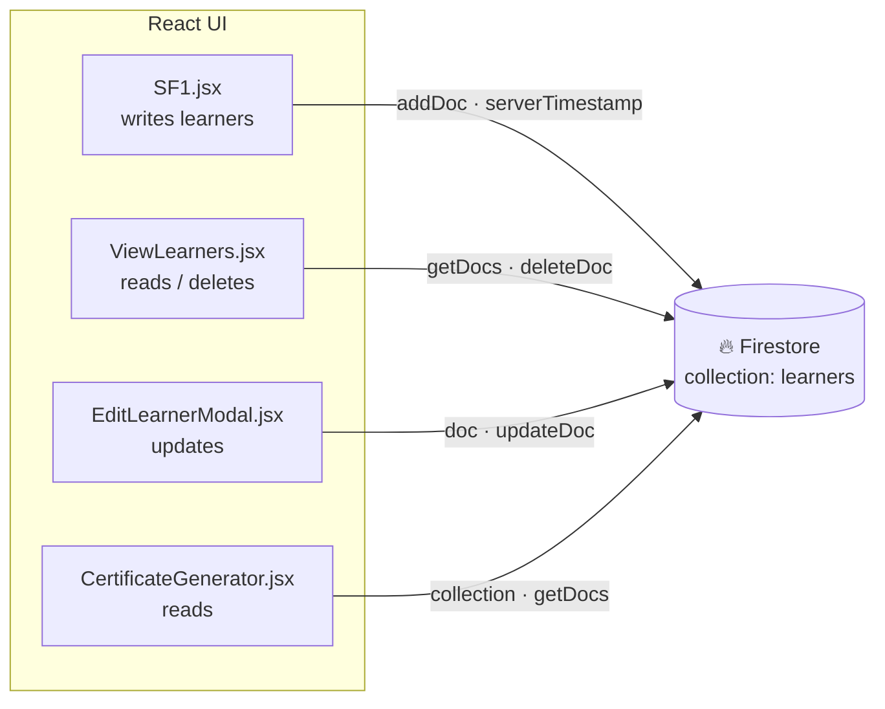

# LIKHA-SIS Project Graph

> Generated with `/graphify .` — visualizes the codebase's architecture.
> Renders in GitHub, VS Code (Mermaid Preview), Typora, Markdown, etc.

---

## 1. Component Hierarchy & Navigation Flow



## 2. Module Dependency Graph (imports)



## 3. Firestore Data Flow



**Legend — codebase at a glance**

| File | Role | Depends on |
|---|---|---|
| `main.jsx` | React entry, mounts `<App/>` | App |
| `App.jsx` | Auth gate + page router | firebase, Login, Dashboard, SF1, ViewLearners, CertificateGenerator |
| `Login.jsx` | Teacher email/password sign-in | firebase/auth |
| `Dashboard.jsx` | Menu hub; navigates to SF1 / ViewLearners / Certificates | firebase/auth |
| `SF1.jsx` | School Form 1 — saves learner info | firebase/firestore |
| `ViewLearners.jsx` | List, filter, delete-saved learners; opens edit modal | firebase/firestore, EditLearnerModal |
| `EditLearnerModal.jsx` | Inline edit of a learner document | firebase/firestore |
| `CertificateGenerator.jsx` | Certificate of Enrollment / Good Moral generator (print) | firebase/firestore, schoolConfig |
| `firebase.js` | Firebase init; exports `auth` + `db` | firebase/app, firebase/auth, firebase/firestore |
| `schoolConfig.js` | School/division/principal placeholder constants | — |

## 4. Text-Only Graph (no renderer needed)

```
                         index.html
                             │
                          main.jsx
                             │
                     ┌───────▼────────┐
                     │   App.jsx      │   ← auth gate + router
                     └───────┬────────┘
                             │
            ┌────────────────┼───────────────────┐
            │              currentPage            │
            ▼                ▼        ▼           ▼
        Login          Dashboard   SF1   ViewLearners
        (no user)     ────(user logged in)────
                         │    │     │
          goToSF1 ───────┘    │     │
          goToViewLearners ───┘     │
          goToCertificates ─────────┘   → CertificateGenerator
                                              │
                                     ViewLearners
                                              │
                                     EditLearnerModal
```